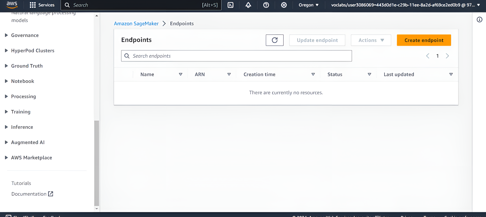

## Introduction to Generative AI with AWS — Domain Expert Models (2 Projects)

This repository contains two completed Udacity projects for “Introduction to Generative AI with AWS,” each building and evaluating a domain expert model on AWS for different domains:

- IT domain expert (Project-1)
- Financial domain expert (Project-2)

Both projects follow the same high-level workflow on AWS: establish a baseline using an Amazon Bedrock foundation model, fine‑tune using a small, domain‑specific dataset in Amazon SageMaker, deploy a real-time SageMaker endpoint, evaluate results, and then clean up all resources.

### Repository structure

- `Project-1/Project_Building_a_Domain_Expert_Model/`
  - `ITDataset.txt` — IT domain dataset used for fine-tuning
  - `Model_Evaluation.ipynb` — baseline evaluation notebook (pre‑fine‑tuning)
  - `Model_FineTuning.ipynb` — fine‑tuning, deployment, testing, and cleanup
  - `Snapshots/` — evidence screenshots (instance setup, uploads, deployment, outputs, cleanup)
- `Project-2/Project_Building_a_Domain_Expert_Model/`
  - `financialDataset.txt` — Financial domain dataset used for fine-tuning
  - `Model_Evaluation.ipynb` — baseline evaluation notebook (pre‑fine‑tuning)
  - `Model_FineTuning.ipynb` — fine‑tuning, deployment, testing, and cleanup
  - `Snapshot/` — evidence screenshots (instance setup, uploads, deployment, outputs, cleanup)

The PDF/DOCX reports in each project folder document the process and results with screenshots.

### What was built

- Two domain-specialized LLMs:
  - IT domain expert: tuned on `ITDataset.txt`
  - Financial domain expert: tuned on `financialDataset.txt`
- End-to-end MLOps flow on AWS SageMaker:
  - Baseline evaluation of a foundation model
  - Fine-tuning on domain data stored in Amazon S3
  - Real-time endpoint deployment for inference
  - Post‑tuning evaluation and comparison
  - Full resource cleanup (endpoints, configs, models, and S3 artifacts as applicable)

### AWS services used

- Amazon Bedrock (foundation model inference for baseline comparisons)
- Amazon SageMaker (Studio/Notebook, Training/Processing, Model/Endpoint)
- Amazon S3 (dataset and model artifacts)
- AWS Identity and Access Management (IAM) for permissions
- Amazon CloudWatch (logs/metrics during training and inference)

### Reproduce locally or in AWS

You can run each project independently. The recommended path is SageMaker Studio (or a SageMaker Notebook Instance). Steps are the same for both projects, just switch to the correct folder and dataset.

1) Environment setup
- Launch SageMaker Studio in your chosen AWS Region
- Create or select an execution role with access to SageMaker and S3
- Create (or choose) an S3 bucket for datasets and artifacts
- Enable Amazon Bedrock access for your account in the Region (and request model access if required)

2) Upload code and data
- Upload the contents of either `Project-1/Project_Building_a_Domain_Expert_Model/` or `Project-2/Project_Building_a_Domain_Expert_Model/` to your Studio environment
- Confirm the domain dataset is present (`ITDataset.txt` or `financialDataset.txt`)

3) Configure notebooks
- Open `Model_Evaluation.ipynb` and `Model_FineTuning.ipynb`
- In the notebook cells where configuration is required, set:
  - AWS Region
  - `S3_BUCKET` (your bucket name)
  - Any role/ARNs or instance types if prompted by the notebook
  - Bedrock model configuration (e.g., `BEDROCK_MODEL_ID`) and ensure the Region supports the model

4) Baseline evaluation
- Run all cells in `Model_Evaluation.ipynb`
- This invokes Amazon Bedrock (bedrock-runtime) to establish pre‑fine‑tuning performance and sample responses

5) Fine-tune, deploy, and test
- Run all cells in `Model_FineTuning.ipynb`
- The notebook will upload data to S3, launch a SageMaker training job to fine‑tune the model, and create a real‑time SageMaker endpoint
- Invoke the endpoint from the notebook to capture post‑tuning outputs and compare to baseline

6) Clean up all resources
- Execute the cleanup cells in `Model_FineTuning.ipynb`
- Verify in the AWS Console that the Endpoint, EndpointConfig, and Model are deleted
- Optionally remove S3 artifacts if they are no longer needed

### Evidence and results

Each project folder contains screenshots documenting the full lifecycle:
- Instance/Studio setup (e.g., `1.Creating_and_Running_Instance.*`)
- Uploads (`2.Uploading_Project_Starter_Files.*`)
- Baseline deployment/evaluation (`3.*Deploying_Model_Evaluation*`, `4.Model_Evaluation_With_Output.*`)
- Fine‑tuning results and deployment (`6.Model_Finetune_With_Output.*`, `8.*Finetuning_Model_Deployment*`)
- Cleanup (`5.Deleted_Model_Deployment_endpoints.*`, `9.*Deleting_Finetune_Model*`)

High‑level observations:
- Post‑tuning responses are more domain‑aware and precise compared to the baseline
- The IT model improves accuracy on IT terminology and troubleshooting‑style prompts
- The Financial model improves accuracy on finance terms and domain‑specific Q&A

### Snapshots

#### Project 1
- **1. Creating and Running Instance**

- **2. Uploading Project Starter Files**

- **3. Deploying Model Evaluation Endpoint**

- **4. Model Evaluation With Output**

- **5. Deleted Model Deployment Endpoints**

- **6. Fine-tuning Output**

- **7. S3 Bucket: Fine-tuned Model Artifacts**

- **8. Fine-tuned Model Deployment**

- **9. Deleting Fine-tuned Model (Notebook Output)**

- **9.1. Deleted Fine-tuned Model Deployment Endpoint**

#### Project 2
- **1. Creating and Running Instance**

- **2. Uploading Project Starter Files**

- **3.1. Deploying Model Evaluation Endpoint Configuration**

- **3. Deploying Model Evaluation Endpoints**

- **4. Model Evaluation With Output**

- **5. Deleted Model Deployment Endpoints**

- **6. Fine-tuning Output**

- **7. S3 Bucket: Fine-tuned Model Artifacts**

- **8.1. Fine-tuned Model Deployment Endpoints Configuration**

- **8. Fine-tuned Model Deployment Endpoints**

- **9. Deleting Fine-tuned Model (Notebook Output)**

- **9.1. Deleted Fine-tuned Model Deployment Endpoint**

### Cost and cleanup

- Training and real‑time endpoints incur costs while running
- Always run the cleanup cells and confirm deletions in the console after testing
- Consider using smaller instance types for experimentation to reduce cost

### Acknowledgements

This work follows the Udacity “Introduction to Generative AI with AWS” project structure and best practices. The provided reports (DOCX/PDF) and screenshots substantiate all steps and results for both domains.
